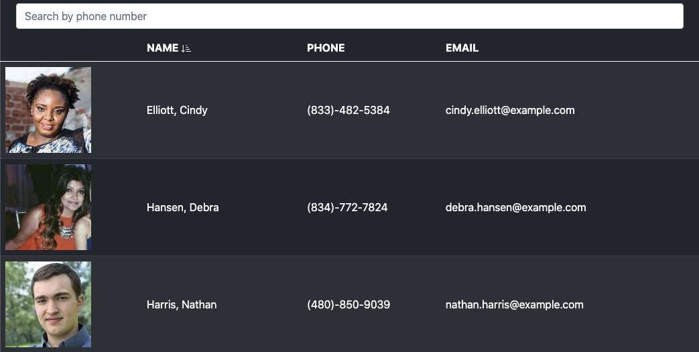

# Employee Directory

The Employee Directory app allows users to sort and filter through a collection of unsensitive employee data. The app leverages React's virtual DOM to quickly render employee data from the Random User API. Search by phone number, or sort by last name to quickly locate an employee.

## Usage

Visit the deployed [Employee Directory](https://roccomaniscalco.github.io/employee-directory/)

## Installation

1. Head over to the [project repository](https://github.com/roccomaniscalco/employee-directory)
2. Press the green 'code' button and select method of download
3. Use [create react app](https://reactjs.org/docs/create-a-new-react-app.html) to start a development server on your local machine
4. Copy 'package.json', 'src', and 'public' to your react app instance
5. Run `npm start` from within the project directory

## Credits

- [Random User Generator](https://randomuser.me/)
- [React](https://reactjs.org/)
- [Bootsrap](https://getbootstrap.com/)
- [Axios](https://www.npmjs.com/package/axios)
- [GH Pages](https://www.npmjs.com/package/gh-pages)

## License

Licensed under the [MIT](https://opensource.org/licenses/MIT) license.